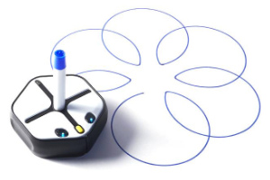

# Root Robot Bluetooth Low Energy Protocol Documentation

[Root](https://rootrobotics.com/) is a toy robot that teaches the basics of coding to kids of all ages and skill levels. For the benefit of developers, makers, and advanced users, we are sharing the Bluetooth Low Energy (BLE) protocol that Root uses to communicate with our app. Using this, you can communicate with Root using any hardware that supports BLE using the language of your choice!



## Table of Contents
1. [Overview](#overview)  
2. [BLE Profile](#ble-profile)  
3. [Packet Components](#packet-components)  
4. [Packet Definitions](#packet-definitions)  
    - [Device 0 - General](#device-0---general)  
    - [Device 1 - Motors](#device-1---motors)  
    - [Device 2 - Marker/Eraser](#device-2---markereraser)  
    - [Device 3 - LED Lights](#device-3---led-lights)  
    - [Device 4 - Color Sensor](#device-4---color-sensor)  
    - [Device 5 - Sound](#device-5---sound)  
    - [Device 12 - Bumpers](#device-12---bumpers)  
    - [Device 13 - Light Sensors](#device-13---light-sensors)  
    - [Device 14 - Battery](#device-14---battery)  
    - [Device 17 - Touch Sensors](#device-17---touch-sensors)  
    - [Device 20 - Cliff Sensor](#device-20---cliff-sensor)  
5. [Example](#example)  
6. [Licenses](#licenses)  

## Overview

The Root Robot uses Bluetooth Low Energy (BLE) for communication to other computing devices like computers, tablets, or phones. It presents itself as a BLE peripheral and requires a connection from a BLE host to operate. A few properties of the robot can be read from static characteristics, but the bulk of communication is done by exchanging serialized packets through RX and TX characteristics.

You can find more information about BLE [here](https://www.bluetooth.com/specifications/gatt/generic-attributes-overview).

## BLE Profile

The Root Robot BLE Profile is organized into characteristics nested within services. Each characteristic and service has a unique identifier or UUID, used for access. There are three main services.

1. **Root Identifier service** `48c5d828-ac2a-442d-97a3-0c9822b04979`

This service is used to identify Root Robots and can be used by BLE hosts that implement *scan for devices with service* methods. The other services are present on other BLE devices but the Root Identifier Service is unique only to Root Robots. This service is empty and contains no characteristics.

2. **Device Information service** `0000180a-0000-1000-8000-00805f9b34fb`

This service contains mostly static information about the Root Robot. It contains the following characteristics.

- **Serial Number characteristic** `00002a25-0000-1000-8000-00805f9b34fb`
    - Serial number string, 12 bytes in length.
    - Ex. `RT0123456789`
- **Firmware Version characteristic** `00002a26-0000-1000-8000-00805f9b34fb`
    - Firmware version string, up to 12 bytes in length.
    - Ex. `1.0`
- **Hardware Version characteristic** `00002a27-0000-1000-8000-00805f9b34fb`
    - Hardware version string, up to 12 bytes in length.
    - Ex. `1.0`
- **Manufacturer characteristic** `00002a29-0000-1000-8000-00805f9b34fb`
    - Manufacturer name string, 13 bytes in length.
    - Ex. `Root Robotics`
- **Robot State characteristic** `00008bb6-0000-1000-8000-00805f9b34fb`
    - Bitfield of select robot sensors, 2 bytes in length.
    - MSB - `0b00<Cliff><L_Bump><R_Bump><RL_Touch><RR_Touch><FL_Touch><FR_Touch>`
    - LSB - `0b0<Battery Percent>`
    - This characteristic is broadcast in the advertising packet. It can be read without connecting to the robot to identify which advertising robot is being touched.

3. **UART service** `6e400001-b5a3-f393-e0a9-e50e24dcca9e`

This service represents an emulated UART port based on the unofficial specifications of Nordic Semiconductor. It contains an RX and TX characteristic.

- **TX characteristic** `6e400002-b5a3-f393-e0a9-e50e24dcca9e`
    - Send packets for robot to execute to this characteristic.
    - Accepts packets of 20 bytes.
    - Supports *write with response* and *write without response* methods.
    - If using *write without response* method, it is the host's responsibility to allow time for the robot to process the packet.
- **RX characteristic** `6e400003-b5a3-f393-e0a9-e50e24dcca9e`
    - Listen to this characteristic for events and responses to packets.
    - Sends packets of 20 bytes.
    - Supports *notify* property.
    - BLE hosts must subscribe to this characteristic before any data can be received from robot.

### BLE Protocol Version

The current BLE protocol version is `1.1`. A table of supported main-board firmware versions is below:

<table>
  <tr>
    <th>Firmware Version</th>
    <th>Protocol Version</th>
  </tr>
  <tr>
    <td>1.10</td>
    <td>1.1</td>
  <tr>
  <tr>
    <td>1.8</td>
    <td>1.1</td>
  <tr>
    <td>1.5</td>
    <td>1.1</td>
  </tr>
  <tr>
    <td>1.4</td>
    <td>1.0</td>
  </tr>
  <tr>
    <td>1.3</td>
    <td>1.0</td>
  </tr>
  <tr>
    <td>1.2</td>
    <td>1.0</td>
  </tr>
  <tr>
    <td>1.1</td>
    <td>1.0</td>
  </tr>
  <tr>
    <td>1.0</td>
    <td>1.0</td>
  </tr>
</table>

## Packet Components

The BLE packets for communication with Root are each 20 bytes long and have a consistent structure:

**Device** (1 byte)

The robot is organized into a collection of logical and independent devices. Each device is a subsystem of the robot (such as the motors or color sensor) that only accepts packets that pertain to itself. The packets each device accepts are detailed in the sections below.

**Command** (1 byte)

Each device implements a series of commands. The command number tells each device how to interpret the contents of the payload. Some commands will trigger the robot to send a response packet.

**Packet ID** (1 byte)

Each packet has an identifying number that can be used to determine if a packet was lost and/or to match responses to the packets that requested them. There are three values that can be in this packet location:

- `Inc.` - An incremental ID managed by the host. This ID number begins at zero and is incremented each time a packet is sent to the robot. When the unsigned 8-bit incremental ID reaches a value of 255 it should roll over to zero again.
- `Req.` - The ID from the packet that requested the response. In cases where the packet is a response to a previous request, the packet ID will match the ID from the request. In this way, the first three bytes of a response packet should match the first three bytes of the requesting packet.
- `Evt.` - An incremental ID managed by the robot. The robot has it's own internal incremental ID used for messages initiated by the robot (e.g. a bumper event). This ID number is incremented each time a packet is sent from the robot not in response to a request from the host. When this unsigned 8-bit incremental ID reaches a value of 255 it will roll over to zero again.

An incremental ID of zero will always be accepted and will reset the count.

**Payload** (16 bytes)

The content of the packet payload can be up to 16 bytes. Any unused bytes in the payload should be set to zero. Data stored in the payload can be signed or unsigned integers of variable width. Values are always little endian and are packed in a left justified manner on an 8-bit boundary.

**Checksum** (1 byte)

The last byte of each packet is a checksum calculated from the previous 19 bytes. This is used to check data integrity. The Root Robot uses a CRC-8 algorithm. An implementation of the CRC-8 checksum calculation can be seen [here](crc/crc.h) and [here](crc/crc.c). A checksum value of zero is always accepted by the robot if a data integrity check is not needed.

Example packet:
<table>
  <tr>
    <th align="right">Byte:</th>
    <th>0</th>
    <th>1</th>
    <th>2</th>
    <th>3</th>
    <th>4</th>
    <th>5</th>
    <th>6</th>
    <th>7</th>
    <th>8</th>
    <th>9</th>
    <th>10</th>
    <th>11</th>
    <th>12</th>
    <th>13</th>
    <th>14</th>
    <th>15</th>
    <th>16</th>
    <th>17</th>
    <th>18</th>
    <th>19</th>
  </tr>
  <tr>
    <th align="right">Type:</th>
    <td>Dev</td>
    <td>Cmd</td>
    <td>ID</td>
    <td align="center" colspan="16">Payload</td>
    <td>CRC</td>
  </tr>
</table>

### Timestamp

Some packets contain a timestamp in the payload field. This timestamp is the number of milliseconds that have elapsed since the robot powered on, represented by an unsigned 32-bit integer. This timestamp is continuously incremented and only resets when the robot is power cycled.

## Packet Definitions

Each packet sent or received by the robot is defined below, organized by device number.

### Device 0 - General

#### To Robot
-------------------------------------------------------------------------------

#### Command 0 - Get Versions

Request a response packet with Command 0 and matching ID containing the software and hardware version numbers.

<table>
  <tr>
    <td>0</td>
    <td>1</td>
    <td>2</td>
    <td>3</td>
    <td>4</td>
    <td>5</td>
    <td>6</td>
    <td>7</td>
    <td>8</td>
    <td>9</td>
    <td>10</td>
    <td>11</td>
    <td>12</td>
    <td>13</td>
    <td>14</td>
    <td>15</td>
    <td>16</td>
    <td>17</td>
    <td>18</td>
    <td>19</td>
  </tr>
  <tr>
    <th>Dev</th>
    <th>Cmd</th>
    <th>ID</th>
    <th colspan="16">Payload</th>
    <th>CRC</th>
  </tr>
  <tr>
    <td>0</td>
    <td>0</td>
    <td>Inc.</td>
    <td>Board</td>
    <td colspan="15"></td>
    <td></td>
  </tr>
</table>

- **Byte 3 - Board** (uint8_t)
    - The board ID to request version numbers for. Can be one of 2 values:
        - `0xA5` - Main board.
        - `0xC6` - Color board.

#### Command 1 - Set Name

Set a new BLE advertising name.

<table>
  <tr>
    <td>0</td>
    <td>1</td>
    <td>2</td>
    <td>3</td>
    <td>4</td>
    <td>5</td>
    <td>6</td>
    <td>7</td>
    <td>8</td>
    <td>9</td>
    <td>10</td>
    <td>11</td>
    <td>12</td>
    <td>13</td>
    <td>14</td>
    <td>15</td>
    <td>16</td>
    <td>17</td>
    <td>18</td>
    <td>19</td>
  </tr>
  <tr>
    <th>Dev</th>
    <th>Cmd</th>
    <th>ID</th>
    <th colspan="16">Payload</th>
    <th>CRC</th>
  </tr>
  <tr>
    <td>0</td>
    <td>1</td>
    <td>Inc.</td>
    <td colspan="16">Name</td>
    <td></td>
  </tr>
</table>

- **Bytes 3:18 - Name** (string)
    - A UTF-8 encoded string containing the new advertising name for the robot.
    - Name string should be null terminated if less than 16 bytes.

#### Command 2 - Get Name

Request a response packet with Command 2 and matching ID containing the current BLE advertising name.

<table>
  <tr>
    <td>0</td>
    <td>1</td>
    <td>2</td>
    <td>3</td>
    <td>4</td>
    <td>5</td>
    <td>6</td>
    <td>7</td>
    <td>8</td>
    <td>9</td>
    <td>10</td>
    <td>11</td>
    <td>12</td>
    <td>13</td>
    <td>14</td>
    <td>15</td>
    <td>16</td>
    <td>17</td>
    <td>18</td>
    <td>19</td>
  </tr>
  <tr>
    <th>Dev</th>
    <th>Cmd</th>
    <th>ID</th>
    <th colspan="16">Payload</th>
    <th>CRC</th>
  </tr>
  <tr>
    <td>0</td>
    <td>2</td>
    <td>Inc.</td>
    <td colspan="16"></td>
    <td></td>
  </tr>
</table>

#### Command 3 - Stop and Reset

Immediately stop the robot and cancel any pending actions. (Same as pressing the stop button in the Root Coding app.)

<table>
  <tr>
    <td>0</td>
    <td>1</td>
    <td>2</td>
    <td>3</td>
    <td>4</td>
    <td>5</td>
    <td>6</td>
    <td>7</td>
    <td>8</td>
    <td>9</td>
    <td>10</td>
    <td>11</td>
    <td>12</td>
    <td>13</td>
    <td>14</td>
    <td>15</td>
    <td>16</td>
    <td>17</td>
    <td>18</td>
    <td>19</td>
  </tr>
  <tr>
    <th>Dev</th>
    <th>Cmd</th>
    <th>ID</th>
    <th colspan="16">Payload</th>
    <th>CRC</th>
  </tr>
  <tr>
    <td>0</td>
    <td>3</td>
    <td>Inc.</td>
    <td colspan="16"></td>
    <td></td>
  </tr>
</table>

#### Command 6 - Disconnect

Instruct robot to immediately terminate BLE connection. This is sometimes faster than disconnecting from BLE host's side.

<table>
  <tr>
    <td>0</td>
    <td>1</td>
    <td>2</td>
    <td>3</td>
    <td>4</td>
    <td>5</td>
    <td>6</td>
    <td>7</td>
    <td>8</td>
    <td>9</td>
    <td>10</td>
    <td>11</td>
    <td>12</td>
    <td>13</td>
    <td>14</td>
    <td>15</td>
    <td>16</td>
    <td>17</td>
    <td>18</td>
    <td>19</td>
  </tr>
  <tr>
    <th>Dev</th>
    <th>Cmd</th>
    <th>ID</th>
    <th colspan="16">Payload</th>
    <th>CRC</th>
  </tr>
  <tr>
    <td>0</td>
    <td>6</td>
    <td>Inc.</td>
    <td colspan="16"></td>
    <td></td>
  </tr>
</table>

#### Command 7 - Enable Events

Enable BLE notification for events by devices on the robot. By default, all events are enabled.

<table>
  <tr>
    <td>0</td>
    <td>1</td>
    <td>2</td>
    <td>3</td>
    <td>4</td>
    <td>5</td>
    <td>6</td>
    <td>7</td>
    <td>8</td>
    <td>9</td>
    <td>10</td>
    <td>11</td>
    <td>12</td>
    <td>13</td>
    <td>14</td>
    <td>15</td>
    <td>16</td>
    <td>17</td>
    <td>18</td>
    <td>19</td>
  </tr>
  <tr>
    <th>Dev</th>
    <th>Cmd</th>
    <th>ID</th>
    <th colspan="16">Payload</th>
    <th>CRC</th>
  </tr>
  <tr>
    <td>0</td>
    <td>7</td>
    <td>Inc.</td>
    <td colspan="16">Devices Bitfield</td>
    <td></td>
  </tr>
</table>

- **Bytes 3:18 - Devices Bitfield** (uint128_t)
    - `1` = enable, `0` = no change
    - This is a 128-bit bitfield representing all devices from Device 0 (LSb) to Device 127 (MSb).
    - Device 0 is bit 0 of byte 18
    - Device 127 is bit 7 of byte 3
    - Multiple devices (up to 128) can be enabled with a single command by setting the bits to 1 that match the device numbers to be enabled.

#### Command 9 - Disable Events

Disable BLE notification for events by device on the robot. By default, all events are enabled.

<table>
  <tr>
    <td>0</td>
    <td>1</td>
    <td>2</td>
    <td>3</td>
    <td>4</td>
    <td>5</td>
    <td>6</td>
    <td>7</td>
    <td>8</td>
    <td>9</td>
    <td>10</td>
    <td>11</td>
    <td>12</td>
    <td>13</td>
    <td>14</td>
    <td>15</td>
    <td>16</td>
    <td>17</td>
    <td>18</td>
    <td>19</td>
  </tr>
  <tr>
    <th>Dev</th>
    <th>Cmd</th>
    <th>ID</th>
    <th colspan="16">Payload</th>
    <th>CRC</th>
  </tr>
  <tr>
    <td>0</td>
    <td>9</td>
    <td>Inc.</td>
    <td colspan="16">Devices Bitfield</td>
    <td></td>
  </tr>
</table>

- **Bytes 3:18 - Devices Bitfield** (uint128_t)
    - `1` = disable, `0` = no change
    - This is a 128-bit bitfield representing all devices from Device 0 (LSb) to Device 127 (MSb).
    - Device 0 is bit 0 of byte 18
    - Device 127 is bit 7 of byte 3
    - Multiple devices (up to 128) can be disabled with a single command by setting the bits to 1 that match the device numbers to be disabled.
    - **Note: Device 0 cannot be disabled**

#### Command 11 - Get Enabled Events

Request a response packet with Command 11 and matching ID containing a bitfield of the enabled devices.

<table>
  <tr>
    <td>0</td>
    <td>1</td>
    <td>2</td>
    <td>3</td>
    <td>4</td>
    <td>5</td>
    <td>6</td>
    <td>7</td>
    <td>8</td>
    <td>9</td>
    <td>10</td>
    <td>11</td>
    <td>12</td>
    <td>13</td>
    <td>14</td>
    <td>15</td>
    <td>16</td>
    <td>17</td>
    <td>18</td>
    <td>19</td>
  </tr>
  <tr>
    <th>Dev</th>
    <th>Cmd</th>
    <th>ID</th>
    <th colspan="16">Payload</th>
    <th>CRC</th>
  </tr>
  <tr>
    <td>0</td>
    <td>11</td>
    <td>Inc.</td>
    <td colspan="16"></td>
    <td></td>
  </tr>
</table>

#### Command 14 - Get Serial Number

Request a response packet with Command 14 and matching ID containing the product serial number.

<table>
  <tr>
    <td>0</td>
    <td>1</td>
    <td>2</td>
    <td>3</td>
    <td>4</td>
    <td>5</td>
    <td>6</td>
    <td>7</td>
    <td>8</td>
    <td>9</td>
    <td>10</td>
    <td>11</td>
    <td>12</td>
    <td>13</td>
    <td>14</td>
    <td>15</td>
    <td>16</td>
    <td>17</td>
    <td>18</td>
    <td>19</td>
  </tr>
  <tr>
    <th>Dev</th>
    <th>Cmd</th>
    <th>ID</th>
    <th colspan="16">Payload</th>
    <th>CRC</th>
  </tr>
  <tr>
    <td>0</td>
    <td>14</td>
    <td>Inc.</td>
    <td colspan="16"></td>
    <td></td>
  </tr>
</table>

#### From Robot
-------------------------------------------------------------------------------

#### Command 0 - Get Versions Response

Response to Get Versions packet.

<table>
  <tr>
    <td>0</td>
    <td>1</td>
    <td>2</td>
    <td>3</td>
    <td>4</td>
    <td>5</td>
    <td>6</td>
    <td>7</td>
    <td>8</td>
    <td>9</td>
    <td>10</td>
    <td>11</td>
    <td>12</td>
    <td>13</td>
    <td>14</td>
    <td>15</td>
    <td>16</td>
    <td>17</td>
    <td>18</td>
    <td>19</td>
  </tr>
  <tr>
    <th>Dev</th>
    <th>Cmd</th>
    <th>ID</th>
    <th colspan="16">Payload</th>
    <th>CRC</th>
  </tr>
  <tr>
    <td>0</td>
    <td>0</td>
    <td>Req.</td>
    <td>Board</td>
    <td>FW Maj</td>
    <td>FW Min</td>
    <td>HW Maj</td>
    <td>HW Min</td>
    <td>Boot Maj</td>
    <td>Boot Min</td>
    <td>Proto Maj</td>
    <td>Proto Min</td>
    <td colspan="7"></td>
    <td></td>
  </tr>
</table>

- **Byte 3 - Board** (uint8_t)
    - The board ID to return version numbers for. Can be one of 2 values:
        - `0xA5` - Main board.
        - `0xC6` - Color board.
- **Byte 4 - FW Maj** (uint8_t)
    - Firmware version major number.
- **Byte 5 - FW Min** (uint8_t)
    - Firmware version minor number.
- **Byte 6 - HW Maj** (uint8_t)
    - Hardware version major number.
- **Byte 7 - HW Min** (uint8_t)
    - Hardware version minor number.
- **Byte 8 - Boot Maj** (uint8_t)
    - Bootloader version major number.
- **Byte 9 - Boot Min** (uint8_t)
    - Bootloader version minor number.
- **Byte 10 - Proto Maj** (uint8_t)
    - Protocol version major number.
- **Byte 11 - Proto Min** (uint8_t)
    - Protocol version minor number.

#### Command 2 - Get Name Response

Response to Get Name packet.

<table>
  <tr>
    <td>0</td>
    <td>1</td>
    <td>2</td>
    <td>3</td>
    <td>4</td>
    <td>5</td>
    <td>6</td>
    <td>7</td>
    <td>8</td>
    <td>9</td>
    <td>10</td>
    <td>11</td>
    <td>12</td>
    <td>13</td>
    <td>14</td>
    <td>15</td>
    <td>16</td>
    <td>17</td>
    <td>18</td>
    <td>19</td>
  </tr>
  <tr>
    <th>Dev</th>
    <th>Cmd</th>
    <th>ID</th>
    <th colspan="16">Payload</th>
    <th>CRC</th>
  </tr>
  <tr>
    <td>0</td>
    <td>2</td>
    <td>Req.</td>
    <td colspan="16">Name</td>
    <td></td>
  </tr>
</table>

- **Bytes 3:18 - Name** (string)
    - A UTF-8 encoded, null terminated string containing the current BLE advertising name.

#### Command 4 - Stop Project

An event indicating that the running project should be stopped. This event is typically triggered by pressing the robot nose button.

<table>
  <tr>
    <td>0</td>
    <td>1</td>
    <td>2</td>
    <td>3</td>
    <td>4</td>
    <td>5</td>
    <td>6</td>
    <td>7</td>
    <td>8</td>
    <td>9</td>
    <td>10</td>
    <td>11</td>
    <td>12</td>
    <td>13</td>
    <td>14</td>
    <td>15</td>
    <td>16</td>
    <td>17</td>
    <td>18</td>
    <td>19</td>
  </tr>
  <tr>
    <th>Dev</th>
    <th>Cmd</th>
    <th>ID</th>
    <th colspan="16">Payload</th>
    <th>CRC</th>
  </tr>
  <tr>
    <td>0</td>
    <td>4</td>
    <td>Evt.</td>
    <td colspan="16"></td>
    <td></td>
  </tr>
</table>

#### Command 11 - Get Enabled Events Response

Response to Get Enabled Events packet.

<table>
  <tr>
    <td>0</td>
    <td>1</td>
    <td>2</td>
    <td>3</td>
    <td>4</td>
    <td>5</td>
    <td>6</td>
    <td>7</td>
    <td>8</td>
    <td>9</td>
    <td>10</td>
    <td>11</td>
    <td>12</td>
    <td>13</td>
    <td>14</td>
    <td>15</td>
    <td>16</td>
    <td>17</td>
    <td>18</td>
    <td>19</td>
  </tr>
  <tr>
    <th>Dev</th>
    <th>Cmd</th>
    <th>ID</th>
    <th colspan="16">Payload</th>
    <th>CRC</th>
  </tr>
  <tr>
    <td>0</td>
    <td>11</td>
    <td>Req.</td>
    <td colspan="16">Devices Bitfield</td>
    <td></td>
  </tr>
</table>

- **Bytes 3:18 - Devices Bitfield** (uint128_t)
    - `1` = enabled, `0` = disabled
    - This is a 128-bit bitfield representing all devices from Device 0 (LSb) to Device 127 (MSb).
    - Device 0 is bit 0 of byte 18
    - Device 127 is bit 7 of byte 3

#### Command 14 - Get Serial Number Response

Response to Get Serial Number packet.

<table>
  <tr>
    <td>0</td>
    <td>1</td>
    <td>2</td>
    <td>3</td>
    <td>4</td>
    <td>5</td>
    <td>6</td>
    <td>7</td>
    <td>8</td>
    <td>9</td>
    <td>10</td>
    <td>11</td>
    <td>12</td>
    <td>13</td>
    <td>14</td>
    <td>15</td>
    <td>16</td>
    <td>17</td>
    <td>18</td>
    <td>19</td>
  </tr>
  <tr>
    <th>Dev</th>
    <th>Cmd</th>
    <th>ID</th>
    <th colspan="16">Payload</th>
    <th>CRC</th>
  </tr>
  <tr>
    <td>0</td>
    <td>14</td>
    <td>Req.</td>
    <td colspan="12">Serial Number</td>
    <td colspan="4"></td>
    <td></td>
  </tr>
</table>

- **Bytes 3:14 - Serial Number** (string)
    - A UTF-8 encoded string containing the product serial number, 12 bytes in length.

### Device 1 - Motors

#### To Robot
-------------------------------------------------------------------------------

#### Command 4 - Set Left and Right Motor Speed

Set the linear velocity for the robot.

<table>
  <tr>
    <td>0</td>
    <td>1</td>
    <td>2</td>
    <td>3</td>
    <td>4</td>
    <td>5</td>
    <td>6</td>
    <td>7</td>
    <td>8</td>
    <td>9</td>
    <td>10</td>
    <td>11</td>
    <td>12</td>
    <td>13</td>
    <td>14</td>
    <td>15</td>
    <td>16</td>
    <td>17</td>
    <td>18</td>
    <td>19</td>
  </tr>
  <tr>
    <th>Dev</th>
    <th>Cmd</th>
    <th>ID</th>
    <th colspan="16">Payload</th>
    <th>CRC</th>
  </tr>
  <tr>
    <td>1</td>
    <td>4</td>
    <td>Inc.</td>
    <td colspan="4">Left Speed</td>
    <td colspan="4">Right Speed</td>
    <td colspan="8"></td>
    <td></td>
  </tr>
</table>

- **Bytes 3:6 - Left Speed** (int32_t)
    - Left motor speed in units of mm/s.
    - Positive values are forwards, negative values are backwards.
    - Minimum value of -100 `0xFFFFFF9C`.
    - Maximum value of 100 `0x00000064`.
- **Bytes 7:10 - Right Speed** (int32_t)
    - Right motor speed in units of mm/s.
    - Positive values are forwards, negative values are backwards.
    - Minimum value of -100 `0xFFFFFF9C`.
    - Maximum value of 100 `0x00000064`.

#### Command 6 - Set Left Motor Speed

Set the linear velocity for the left motor only.

<table>
  <tr>
    <td>0</td>
    <td>1</td>
    <td>2</td>
    <td>3</td>
    <td>4</td>
    <td>5</td>
    <td>6</td>
    <td>7</td>
    <td>8</td>
    <td>9</td>
    <td>10</td>
    <td>11</td>
    <td>12</td>
    <td>13</td>
    <td>14</td>
    <td>15</td>
    <td>16</td>
    <td>17</td>
    <td>18</td>
    <td>19</td>
  </tr>
  <tr>
    <th>Dev</th>
    <th>Cmd</th>
    <th>ID</th>
    <th colspan="16">Payload</th>
    <th>CRC</th>
  </tr>
  <tr>
    <td>1</td>
    <td>6</td>
    <td>Inc.</td>
    <td colspan="4">Left Speed</td>
    <td colspan="12"></td>
    <td></td>
  </tr>
</table>

- **Bytes 3:6 - Left Speed** (int32_t)
    - Left motor speed in units of mm/s.
    - Positive values are forwards, negative values are backwards.
    - Minimum value of -100 `0xFFFFFF9C`.
    - Maximum value of 100 `0x00000064`.

#### Command 7 - Set Right Motor Speed

Set the linear velocity for the right motor only.

<table>
  <tr>
    <td>0</td>
    <td>1</td>
    <td>2</td>
    <td>3</td>
    <td>4</td>
    <td>5</td>
    <td>6</td>
    <td>7</td>
    <td>8</td>
    <td>9</td>
    <td>10</td>
    <td>11</td>
    <td>12</td>
    <td>13</td>
    <td>14</td>
    <td>15</td>
    <td>16</td>
    <td>17</td>
    <td>18</td>
    <td>19</td>
  </tr>
  <tr>
    <th>Dev</th>
    <th>Cmd</th>
    <th>ID</th>
    <th colspan="16">Payload</th>
    <th>CRC</th>
  </tr>
  <tr>
    <td>1</td>
    <td>7</td>
    <td>Inc.</td>
    <td colspan="4">Right Speed</td>
    <td colspan="12"></td>
    <td></td>
  </tr>
</table>

- **Bytes 3:6 - Right Speed** (int32_t)
    - Right motor speed in units of mm/s.
    - Positive values are forwards, negative values are backwards.
    - Minimum value of -100 `0xFFFFFF9C`.
    - Maximum value of 100 `0x00000064`.

#### Command 8 - Drive Distance

Drive a set distance in a straight line. Robot sends a Drive Distance Finished response packet with Command 8 and matching ID when finished.

<table>
  <tr>
    <td>0</td>
    <td>1</td>
    <td>2</td>
    <td>3</td>
    <td>4</td>
    <td>5</td>
    <td>6</td>
    <td>7</td>
    <td>8</td>
    <td>9</td>
    <td>10</td>
    <td>11</td>
    <td>12</td>
    <td>13</td>
    <td>14</td>
    <td>15</td>
    <td>16</td>
    <td>17</td>
    <td>18</td>
    <td>19</td>
  </tr>
  <tr>
    <th>Dev</th>
    <th>Cmd</th>
    <th>ID</th>
    <th colspan="16">Payload</th>
    <th>CRC</th>
  </tr>
  <tr>
    <td>1</td>
    <td>8</td>
    <td>Inc.</td>
    <td colspan="4">Distance</td>
    <td colspan="12"></td>
    <td></td>
  </tr>
</table>

- **Bytes 3:6 - Distance** (int32_t)
    - Distance in units of mm.
    - Positive values are forwards, negative values are backwards.
    - Minimum value of -2147483648 `0x80000000`.
    - Maximum value of 2147483647 `0x7FFFFFFF`.

#### Command 12 - Rotate Angle

Rotate in place by a set angle. Robot sends a Rotate Angle Finished response packet with Command 12 and matching ID when finished.

<table>
  <tr>
    <td>0</td>
    <td>1</td>
    <td>2</td>
    <td>3</td>
    <td>4</td>
    <td>5</td>
    <td>6</td>
    <td>7</td>
    <td>8</td>
    <td>9</td>
    <td>10</td>
    <td>11</td>
    <td>12</td>
    <td>13</td>
    <td>14</td>
    <td>15</td>
    <td>16</td>
    <td>17</td>
    <td>18</td>
    <td>19</td>
  </tr>
  <tr>
    <th>Dev</th>
    <th>Cmd</th>
    <th>ID</th>
    <th colspan="16">Payload</th>
    <th>CRC</th>
  </tr>
  <tr>
    <td>1</td>
    <td>12</td>
    <td>Inc.</td>
    <td colspan="4">Angle</td>
    <td colspan="12"></td>
    <td></td>
  </tr>
</table>

- **Bytes 3:6 - Angle** (int32_t)
    - Angle in units of decidegrees (1/10 of degrees).
    - Positive values are clockwise, negative values are counterclockwise.
    - Minimum value of -2147483648 `0x80000000`.
    - Maximum value of 2147483647 `0x7FFFFFFF`.

#### From Robot
-------------------------------------------------------------------------------

#### Command 8 - Drive Distance Finished Response

Response to Drive Distance packet sent after robot has finished driving.

<table>
  <tr>
    <td>0</td>
    <td>1</td>
    <td>2</td>
    <td>3</td>
    <td>4</td>
    <td>5</td>
    <td>6</td>
    <td>7</td>
    <td>8</td>
    <td>9</td>
    <td>10</td>
    <td>11</td>
    <td>12</td>
    <td>13</td>
    <td>14</td>
    <td>15</td>
    <td>16</td>
    <td>17</td>
    <td>18</td>
    <td>19</td>
  </tr>
  <tr>
    <th>Dev</th>
    <th>Cmd</th>
    <th>ID</th>
    <th colspan="16">Payload</th>
    <th>CRC</th>
  </tr>
  <tr>
    <td>1</td>
    <td>8</td>
    <td>Req.</td>
    <td colspan="16"></td>
    <td></td>
  </tr>
</table>

#### Command 12 - Rotate Angle Finished Response

Response to Rotate Angle packet sent after robot has finished rotating.

<table>
  <tr>
    <td>0</td>
    <td>1</td>
    <td>2</td>
    <td>3</td>
    <td>4</td>
    <td>5</td>
    <td>6</td>
    <td>7</td>
    <td>8</td>
    <td>9</td>
    <td>10</td>
    <td>11</td>
    <td>12</td>
    <td>13</td>
    <td>14</td>
    <td>15</td>
    <td>16</td>
    <td>17</td>
    <td>18</td>
    <td>19</td>
  </tr>
  <tr>
    <th>Dev</th>
    <th>Cmd</th>
    <th>ID</th>
    <th colspan="16">Payload</th>
    <th>CRC</th>
  </tr>
  <tr>
    <td>1</td>
    <td>12</td>
    <td>Req.</td>
    <td colspan="16"></td>
    <td></td>
  </tr>
</table>

#### Command 29 - Motor Stall Event

Motor has stalled event. The robot sends a Motor Stall Event whenever a stall is detected for one of the motors.

<table>
  <tr>
    <td>0</td>
    <td>1</td>
    <td>2</td>
    <td>3</td>
    <td>4</td>
    <td>5</td>
    <td>6</td>
    <td>7</td>
    <td>8</td>
    <td>9</td>
    <td>10</td>
    <td>11</td>
    <td>12</td>
    <td>13</td>
    <td>14</td>
    <td>15</td>
    <td>16</td>
    <td>17</td>
    <td>18</td>
    <td>19</td>
  </tr>
  <tr>
    <th>Dev</th>
    <th>Cmd</th>
    <th>ID</th>
    <th colspan="16">Payload</th>
    <th>CRC</th>
  </tr>
  <tr>
    <td>1</td>
    <td>29</td>
    <td>Evt.</td>
    <td colspan="4">Timestamp</td>
    <td>Motor</td>
    <td>Cause</td>
    <td colspan="10"></td>
    <td></td>
  </tr>
</table>

- **Bytes 3:6 - Timestamp** (uint32_t)
    - Timestamp in units of milliseconds.
- **Byte 7 - Motor** (uint8_t)
    - Stalled motor. Can be one of 3 values:
        - `0` - Left motor.
        - `1` - Right motor.
        - `2` - Marker/eraser motor.
- **Byte 8 - Cause** (uint8_t)
    - Cause for motor stall. Can be one of 6 values:
        - `0` - No stall.
        - `1` - Overcurrent.
        - `2` - Undercurrent.
        - `3` - Underspeed.
        - `4` - Saturated PID.
        - `5` - Timeout.

### Device 2 - Marker/Eraser

#### To Robot
-------------------------------------------------------------------------------

#### Command 0 - Set Marker/Eraser Position

Set the position of the marker/eraser actuator. Robot sends a Marker/Eraser Position Finished packet with Command 0 and matching ID when finished.

<table>
  <tr>
    <td>0</td>
    <td>1</td>
    <td>2</td>
    <td>3</td>
    <td>4</td>
    <td>5</td>
    <td>6</td>
    <td>7</td>
    <td>8</td>
    <td>9</td>
    <td>10</td>
    <td>11</td>
    <td>12</td>
    <td>13</td>
    <td>14</td>
    <td>15</td>
    <td>16</td>
    <td>17</td>
    <td>18</td>
    <td>19</td>
  </tr>
  <tr>
    <th>Dev</th>
    <th>Cmd</th>
    <th>ID</th>
    <th colspan="16">Payload</th>
    <th>CRC</th>
  </tr>
  <tr>
    <td>2</td>
    <td>0</td>
    <td>Inc.</td>
    <td>Position</td>
    <td colspan="15"></td>
    <td></td>
  </tr>
</table>

- **Byte 3 - Position** (uint8_t)
    - Position can be one of three values:
        - `0` - Marker Up/Eraser Up
        - `1` - Marker Down/Eraser Up
        - `2` - Marker Up/Eraser Down

#### From Robot
-------------------------------------------------------------------------------

#### Command 0 - Marker/Eraser Position Finished Response

Response to Set Marker/Eraser Position sent after marker/eraser actuator has finished moving.

<table>
  <tr>
    <td>0</td>
    <td>1</td>
    <td>2</td>
    <td>3</td>
    <td>4</td>
    <td>5</td>
    <td>6</td>
    <td>7</td>
    <td>8</td>
    <td>9</td>
    <td>10</td>
    <td>11</td>
    <td>12</td>
    <td>13</td>
    <td>14</td>
    <td>15</td>
    <td>16</td>
    <td>17</td>
    <td>18</td>
    <td>19</td>
  </tr>
  <tr>
    <th>Dev</th>
    <th>Cmd</th>
    <th>ID</th>
    <th colspan="16">Payload</th>
    <th>CRC</th>
  </tr>
  <tr>
    <td>2</td>
    <td>0</td>
    <td>Req.</td>
    <td>Position</td>
    <td colspan="15"></td>
    <td></td>
  </tr>
</table>

- **Byte 3 - Position** (uint8_t)
    - Position is one of three values:
        - `0` - Marker Up/Eraser Up
        - `1` - Marker Down/Eraser Up
        - `2` - Marker Up/Eraser Down

### Device 3 - LED Lights

#### To Robot
-------------------------------------------------------------------------------

#### Command 3 - Set LED Animation

Set LED cross animation type and color.

<table>
  <tr>
    <td>0</td>
    <td>1</td>
    <td>2</td>
    <td>3</td>
    <td>4</td>
    <td>5</td>
    <td>6</td>
    <td>7</td>
    <td>8</td>
    <td>9</td>
    <td>10</td>
    <td>11</td>
    <td>12</td>
    <td>13</td>
    <td>14</td>
    <td>15</td>
    <td>16</td>
    <td>17</td>
    <td>18</td>
    <td>19</td>
  </tr>
  <tr>
    <th>Dev</th>
    <th>Cmd</th>
    <th>ID</th>
    <th colspan="16">Payload</th>
    <th>CRC</th>
  </tr>
  <tr>
    <td>3</td>
    <td>2</td>
    <td>Inc.</td>
    <td>State</td>
    <td>Red</td>
    <td>Green</td>
    <td>Blue</td>
    <td colspan="12"></td>
    <td></td>
  </tr>
</table>

- **Byte 3 - State** (uint8_t)
    - LED State can be one of four values:
        - `0` - Off
        - `1` - On
        - `2` - Blink Animation
        - `3` - Spin Animation
- **Byte 4 - Red** (uint8_t)
    - Brightness level for the red LED channel.
    - Off is `0`, Full brightness is `255`.
- **Byte 5 - Green** (uint8_t)
    - Brightness level for the green LED channel.
    - Off is `0`, Full brightness is `255`.
- **Byte 6 - Blue** (uint8_t)
    - Brightness level for the blue LED channel.
    - Off is `0`, Full brightness is `255`.

### Device 4 - Color Sensor

#### To Robot
-------------------------------------------------------------------------------

#### Command 1 - Get Color Sensor Data

Request a response packet with Command 1 and matching ID with color sensor data.

<table>
  <tr>
    <td>0</td>
    <td>1</td>
    <td>2</td>
    <td>3</td>
    <td>4</td>
    <td>5</td>
    <td>6</td>
    <td>7</td>
    <td>8</td>
    <td>9</td>
    <td>10</td>
    <td>11</td>
    <td>12</td>
    <td>13</td>
    <td>14</td>
    <td>15</td>
    <td>16</td>
    <td>17</td>
    <td>18</td>
    <td>19</td>
  </tr>
  <tr>
    <th>Dev</th>
    <th>Cmd</th>
    <th>ID</th>
    <th colspan="16">Payload</th>
    <th>CRC</th>
  </tr>
  <tr>
    <td>4</td>
    <td>1</td>
    <td>Inc.</td>
    <td>Bank</td>
    <td>Lighting</td>
    <td>Format</td>
    <td colspan="13"></td>
    <td></td>
  </tr>
</table>

- **Byte 3 - Sensor Bank** (uint8_t)
    - 32 color sensors are split into 4 banks of 8 sensors from left to right. Bank can be one of 4 values:
        - `0` - Sensors 0 to 7
        - `1` - Sensors 8 to 15
        - `2` - Sensors 16 to 23
        - `3` - Sensors 24 to 31
- **Byte 4 - Lighting** (uint8_t)
    - Set the LED illumination during measurement. Lighting can be one of 5 values:
        - `0` - Off
        - `1` - Red
        - `2` - Green
        - `3` - Blue
        - `4` - All
- **Byte 5 - Format** (uint8_t)
    - Set the data format. Format can be one of 2 values:
        - `0` - 12-bit ADC counts
        - `1` - millivolts

#### From Robot
-------------------------------------------------------------------------------

#### Command 1 - Color Sensor Data Response

Response to Get Color Sensor Data packet.

<table>
  <tr>
    <td>0</td>
    <td>1</td>
    <td>2</td>
    <td>3</td>
    <td>4</td>
    <td>5</td>
    <td>6</td>
    <td>7</td>
    <td>8</td>
    <td>9</td>
    <td>10</td>
    <td>11</td>
    <td>12</td>
    <td>13</td>
    <td>14</td>
    <td>15</td>
    <td>16</td>
    <td>17</td>
    <td>18</td>
    <td>19</td>
  </tr>
  <tr>
    <th>Dev</th>
    <th>Cmd</th>
    <th>ID</th>
    <th colspan="16">Payload</th>
    <th>CRC</th>
  </tr>
  <tr>
    <td>4</td>
    <td>1</td>
    <td>Req.</td>
    <td colspan="2">Data</td>
    <td colspan="2">Data</td>
    <td colspan="2">Data</td>
    <td colspan="2">Data</td>
    <td colspan="2">Data</td>
    <td colspan="2">Data</td>
    <td colspan="2">Data</td>
    <td colspan="2">Data</td>
    <td></td>
  </tr>
</table>

- **Byte 3:18 - Data** (uint16_t)
    - Eight 16-bit color sensor values.
    - For the sensors left to right in the bank selected by the Get Color Data packet.
    - In the format selected by the Get Color Data packet.

#### Command 2 - Color Sensor Event

Detected new color event. The robot sends a Color Sensor Event whenever one of the 32 color sensors identifies a change in color underneath the robot.

<table>
  <tr>
    <td>0</td>
    <td>1</td>
    <td>2</td>
    <td colspan="2">3</td>
    <td colspan="2">4</td>
    <td colspan="2">5</td>
    <td colspan="2">6</td>
    <td colspan="2">7</td>
    <td colspan="2">8</td>
    <td colspan="2">9</td>
    <td colspan="2">10</td>
    <td colspan="2">11</td>
    <td colspan="2">12</td>
    <td colspan="2">13</td>
    <td colspan="2">14</td>
    <td colspan="2">15</td>
    <td colspan="2">16</td>
    <td colspan="2">17</td>
    <td colspan="2">18</td>
    <td>19</td>
  </tr>
  <tr>
    <th>Dev</th>
    <th>Cmd</th>
    <th>ID</th>
    <th colspan="32">Payload</th>
    <th>CRC</th>
  </tr>
  <tr>
    <td>4</td>
    <td>2</td>
    <td>Evt.</td>
    <td>Color</td>
    <td>Color</td>
    <td>Color</td>
    <td>Color</td>
    <td>Color</td>
    <td>Color</td>
    <td>Color</td>
    <td>Color</td>
    <td>Color</td>
    <td>Color</td>
    <td>Color</td>
    <td>Color</td>
    <td>Color</td>
    <td>Color</td>
    <td>Color</td>
    <td>Color</td>
    <td>Color</td>
    <td>Color</td>
    <td>Color</td>
    <td>Color</td>
    <td>Color</td>
    <td>Color</td>
    <td>Color</td>
    <td>Color</td>
    <td>Color</td>
    <td>Color</td>
    <td>Color</td>
    <td>Color</td>
    <td>Color</td>
    <td>Color</td>
    <td>Color</td>
    <td>Color</td>
    <td></td>
  </tr>
</table>

- **Nibbles 6:37 - Color** (uint4_t)
    - 32 4-bit identified color values.
    - In order from left to right, sensor 0 to sensor 31.
    - Color can have one of 5 values:
        - `0` - White
        - `1` - Black
        - `2` - Red
        - `3` - Green
        - `4` - Blue

### Device 5 - Sound

#### To Robot
-------------------------------------------------------------------------------

#### Command 0 - Play Note

Play a frequency from the robot's buzzer. Robot sends a Play Note Finished response packet with Command 0 and matching ID when finished.

<table>
  <tr>
    <td>0</td>
    <td>1</td>
    <td>2</td>
    <td>3</td>
    <td>4</td>
    <td>5</td>
    <td>6</td>
    <td>7</td>
    <td>8</td>
    <td>9</td>
    <td>10</td>
    <td>11</td>
    <td>12</td>
    <td>13</td>
    <td>14</td>
    <td>15</td>
    <td>16</td>
    <td>17</td>
    <td>18</td>
    <td>19</td>
  </tr>
  <tr>
    <th>Dev</th>
    <th>Cmd</th>
    <th>ID</th>
    <th colspan="16">Payload</th>
    <th>CRC</th>
  </tr>
  <tr>
    <td>5</td>
    <td>0</td>
    <td>Inc.</td>
    <td colspan="4">Frequency</td>
    <td colspan="2">Duration</td>
    <td colspan="10"></td>
    <td></td>
  </tr>
</table>

- **Byte 3:6 - Frequency** (uint32_t)
    - Frequency of note in units of Hz.
- **Byte 7:8 - Duration** (uint16_t)
    - Duration of note in units of milliseconds.
    - A duration of zero cancels any currently playing notes.

#### Command 1 - Stop Note

Immediately stop any playing note.

<table>
  <tr>
    <td>0</td>
    <td>1</td>
    <td>2</td>
    <td>3</td>
    <td>4</td>
    <td>5</td>
    <td>6</td>
    <td>7</td>
    <td>8</td>
    <td>9</td>
    <td>10</td>
    <td>11</td>
    <td>12</td>
    <td>13</td>
    <td>14</td>
    <td>15</td>
    <td>16</td>
    <td>17</td>
    <td>18</td>
    <td>19</td>
  </tr>
  <tr>
    <th>Dev</th>
    <th>Cmd</th>
    <th>ID</th>
    <th colspan="16">Payload</th>
    <th>CRC</th>
  </tr>
  <tr>
    <td>5</td>
    <td>1</td>
    <td>Inc.</td>
    <td colspan="16"></td>
    <td></td>
  </tr>
</table>

#### Command 4 - Say Phrase

Speak a text string in robot language. Robot sends a Say Phrase Finished response packet with Command 4 and matching ID when finished.

<table>
  <tr>
    <td>0</td>
    <td>1</td>
    <td>2</td>
    <td>3</td>
    <td>4</td>
    <td>5</td>
    <td>6</td>
    <td>7</td>
    <td>8</td>
    <td>9</td>
    <td>10</td>
    <td>11</td>
    <td>12</td>
    <td>13</td>
    <td>14</td>
    <td>15</td>
    <td>16</td>
    <td>17</td>
    <td>18</td>
    <td>19</td>
  </tr>
  <tr>
    <th>Dev</th>
    <th>Cmd</th>
    <th>ID</th>
    <th colspan="16">Payload</th>
    <th>CRC</th>
  </tr>
  <tr>
    <td>5</td>
    <td>4</td>
    <td>Inc.</td>
    <td colspan="16">Phrase</td>
    <td></td>
  </tr>
</table>

- **Bytes 3:18 - Phrase** (string)
    - UTF-8 encoded string with text to speak.
    - String should be null terminated if less than 16 bytes.

#### From Robot
-------------------------------------------------------------------------------

#### Command 0 - Play Note Finished Response

Response to Play Note packet sent after robot has finished playing note.

<table>
  <tr>
    <td>0</td>
    <td>1</td>
    <td>2</td>
    <td>3</td>
    <td>4</td>
    <td>5</td>
    <td>6</td>
    <td>7</td>
    <td>8</td>
    <td>9</td>
    <td>10</td>
    <td>11</td>
    <td>12</td>
    <td>13</td>
    <td>14</td>
    <td>15</td>
    <td>16</td>
    <td>17</td>
    <td>18</td>
    <td>19</td>
  </tr>
  <tr>
    <th>Dev</th>
    <th>Cmd</th>
    <th>ID</th>
    <th colspan="16">Payload</th>
    <th>CRC</th>
  </tr>
  <tr>
    <td>5</td>
    <td>0</td>
    <td>Req.</td>
    <td colspan="16"></td>
    <td></td>
  </tr>
</table>

#### Command 4 - Say Phrase Finished Response

Response to Say Phrase packet sent after robot has finished speaking phrase.

<table>
  <tr>
    <td>0</td>
    <td>1</td>
    <td>2</td>
    <td>3</td>
    <td>4</td>
    <td>5</td>
    <td>6</td>
    <td>7</td>
    <td>8</td>
    <td>9</td>
    <td>10</td>
    <td>11</td>
    <td>12</td>
    <td>13</td>
    <td>14</td>
    <td>15</td>
    <td>16</td>
    <td>17</td>
    <td>18</td>
    <td>19</td>
  </tr>
  <tr>
    <th>Dev</th>
    <th>Cmd</th>
    <th>ID</th>
    <th colspan="16">Payload</th>
    <th>CRC</th>
  </tr>
  <tr>
    <td>5</td>
    <td>4</td>
    <td>Req.</td>
    <td colspan="16"></td>
    <td></td>
  </tr>
</table>

### Device 12 - Bumpers

#### From Robot
-------------------------------------------------------------------------------

#### Command 0 - Bumper Event

Bumper state changed event. The robot sends a Bumper Event whenever one of the bumpers is pressed or released.

<table>
  <tr>
    <td>0</td>
    <td>1</td>
    <td>2</td>
    <td>3</td>
    <td>4</td>
    <td>5</td>
    <td>6</td>
    <td>7</td>
    <td>8</td>
    <td>9</td>
    <td>10</td>
    <td>11</td>
    <td>12</td>
    <td>13</td>
    <td>14</td>
    <td>15</td>
    <td>16</td>
    <td>17</td>
    <td>18</td>
    <td>19</td>
  </tr>
  <tr>
    <th>Dev</th>
    <th>Cmd</th>
    <th>ID</th>
    <th colspan="16">Payload</th>
    <th>CRC</th>
  </tr>
  <tr>
    <td>12</td>
    <td>0</td>
    <td>Evt.</td>
    <td colspan="4">Timestamp</td>
    <td>State</td>
    <td colspan="11"></td>
    <td></td>
  </tr>
</table>

- **Bytes 3:6 - Timestamp** (uint32_t)
    - Timestamp in units of milliseconds.
- **Byte 7 - State** (uint8_t)
    - New bumper state. Can be one of 4 values:
        - `0x00` - No bumpers pressed.
        - `0x40` - Right bumper pressed.
        - `0x80` - Left bumper pressed.
        - `0xC0` - Both bumpers pressed.

### Device 13 - Light Sensors

#### From Robot
-------------------------------------------------------------------------------

#### Command 0 - Light Event

Ambient light changed event. The robot sends a Light Event whenever a new ambient light state from the robot's eyes is detected.

<table>
  <tr>
    <td>0</td>
    <td>1</td>
    <td>2</td>
    <td>3</td>
    <td>4</td>
    <td>5</td>
    <td>6</td>
    <td>7</td>
    <td>8</td>
    <td>9</td>
    <td>10</td>
    <td>11</td>
    <td>12</td>
    <td>13</td>
    <td>14</td>
    <td>15</td>
    <td>16</td>
    <td>17</td>
    <td>18</td>
    <td>19</td>
  </tr>
  <tr>
    <th>Dev</th>
    <th>Cmd</th>
    <th>ID</th>
    <th colspan="16">Payload</th>
    <th>CRC</th>
  </tr>
  <tr>
    <td>13</td>
    <td>0</td>
    <td>Evt.</td>
    <td colspan="4">Timestamp</td>
    <td>State</td>
    <td colspan="2">Left</td>
    <td colspan="2">Right</td>
    <td colspan="7"></td>
    <td></td>
  </tr>
</table>

- **Bytes 3:6 - Timestamp** (uint32_t)
    - Timestamp in units of milliseconds.
- **Byte 7 - State** (uint8_t)
    - New ambient light state. Can be one of 4 values:
        - `4` - Both eyes dark.
        - `5` - Right eye brighter than left eye.
        - `6` - Left eye brighter than right eye.
        - `7` - Both eyes bright.
- **Bytes 8:9 - Left** (uint16_t)
    - Left eye ambient light level in units of millivolts.
- **Bytes 10:11 - Right** (uint16_t)
    - Right eye ambient light level in units of millivolts.

### Device 14 - Battery

#### To Robot
-------------------------------------------------------------------------------

#### Command 1 - Get Battery Level

Request a response packet with Command 1 and matching ID containing the battery level.

<table>
  <tr>
    <td>0</td>
    <td>1</td>
    <td>2</td>
    <td>3</td>
    <td>4</td>
    <td>5</td>
    <td>6</td>
    <td>7</td>
    <td>8</td>
    <td>9</td>
    <td>10</td>
    <td>11</td>
    <td>12</td>
    <td>13</td>
    <td>14</td>
    <td>15</td>
    <td>16</td>
    <td>17</td>
    <td>18</td>
    <td>19</td>
  </tr>
  <tr>
    <th>Dev</th>
    <th>Cmd</th>
    <th>ID</th>
    <th colspan="16">Payload</th>
    <th>CRC</th>
  </tr>
  <tr>
    <td>14</td>
    <td>1</td>
    <td>Inc.</td>
    <td colspan="16"></td>
    <td></td>
  </tr>
</table>

#### From Robot
-------------------------------------------------------------------------------

#### Command 0 - Battery Level Event

Battery level changed event. The robot sends a Battery Level Event whenever the battery level drops by more than 10%.

<table>
  <tr>
    <td>0</td>
    <td>1</td>
    <td>2</td>
    <td>3</td>
    <td>4</td>
    <td>5</td>
    <td>6</td>
    <td>7</td>
    <td>8</td>
    <td>9</td>
    <td>10</td>
    <td>11</td>
    <td>12</td>
    <td>13</td>
    <td>14</td>
    <td>15</td>
    <td>16</td>
    <td>17</td>
    <td>18</td>
    <td>19</td>
  </tr>
  <tr>
    <th>Dev</th>
    <th>Cmd</th>
    <th>ID</th>
    <th colspan="16">Payload</th>
    <th>CRC</th>
  </tr>
  <tr>
    <td>14</td>
    <td>0</td>
    <td>Evt.</td>
    <td colspan="4">Timestamp</td>
    <td colspan="2">Voltage</td>
    <td>Percent</td>
    <td colspan="9"></td>
    <td></td>
  </tr>
</table>

- **Bytes 3:6 - Timestamp** (uint32_t)
    - Timestamp in units of milliseconds.
- **Bytes 7:8 - Voltage** (uint16_t)
    - Battery voltage in units of millivolts.
- **Byte 9 - Percent** (uint8_t)
    - Battery percent.

#### Command 1 - Get Battery Level Response

Response to Get Battery Level packet.

<table>
  <tr>
    <td>0</td>
    <td>1</td>
    <td>2</td>
    <td>3</td>
    <td>4</td>
    <td>5</td>
    <td>6</td>
    <td>7</td>
    <td>8</td>
    <td>9</td>
    <td>10</td>
    <td>11</td>
    <td>12</td>
    <td>13</td>
    <td>14</td>
    <td>15</td>
    <td>16</td>
    <td>17</td>
    <td>18</td>
    <td>19</td>
  </tr>
  <tr>
    <th>Dev</th>
    <th>Cmd</th>
    <th>ID</th>
    <th colspan="16">Payload</th>
    <th>CRC</th>
  </tr>
  <tr>
    <td>14</td>
    <td>1</td>
    <td>Req.</td>
    <td colspan="4">Timestamp</td>
    <td colspan="2">Voltage</td>
    <td>Percent</td>
    <td colspan="9"></td>
    <td></td>
  </tr>
</table>

- **Bytes 3:6 - Timestamp** (uint32_t)
    - Timestamp in units of milliseconds.
- **Bytes 7:8 - Voltage** (uint16_t)
    - Battery voltage in units of millivolts.
- **Byte 9 - Percent** (uint8_t)
    - Battery percent.

### Device 17 - Touch Sensors

#### From Robot
-------------------------------------------------------------------------------

#### Command 0 - Touch Sensor Event

Touch Sensor changed event. The robot sends a Touch Sensor Event whenever one or more of the four top touch sensors are pressed or released.

<table>
  <tr>
    <td>0</td>
    <td>1</td>
    <td>2</td>
    <td>3</td>
    <td>4</td>
    <td>5</td>
    <td>6</td>
    <td colspan="2">7</td>
    <td>8</td>
    <td>9</td>
    <td>10</td>
    <td>11</td>
    <td>12</td>
    <td>13</td>
    <td>14</td>
    <td>15</td>
    <td>16</td>
    <td>17</td>
    <td>18</td>
    <td>19</td>
  </tr>
  <tr>
    <th>Dev</th>
    <th>Cmd</th>
    <th>ID</th>
    <th colspan="17">Payload</th>
    <th>CRC</th>
  </tr>
  <tr>
    <td>17</td>
    <td>0</td>
    <td>Evt.</td>
    <td colspan="4">Timestamp</td>
    <td>State</td>
    <td></td>
    <td colspan="11"></td>
    <td></td>
  </tr>
</table>

- **Bytes 3:6 - Timestamp** (uint32_t)
    - Timestamp in units of milliseconds.
- **Byte 7, upper nibble - State** (uint4_t)
    - Bitfield for the state of touch sensors.
    - Most significant 4 bits of byte 7.
    - Sensor is touched if bit is set.
    - Sensor is untouched if bit is clear.
    - Format - `0b<FL><FR><RR><RL>` where:
        - `FL` - Front Left sensor.
        - `FR` - Front Right sensor.
        - `RR` - Rear Right sensor.
        - `RL` - Rear Left sensor.

### Device 20 - Cliff Sensor

#### From Robot
-------------------------------------------------------------------------------

#### Command 0 - Cliff Event

Cliff detected event. The robot sends a Cliff Event whenever the IR cliff sensor detects the front of the robot is over a cliff or a detected cliff is no longer present.

<table>
  <tr>
    <td>0</td>
    <td>1</td>
    <td>2</td>
    <td>3</td>
    <td>4</td>
    <td>5</td>
    <td>6</td>
    <td>7</td>
    <td>8</td>
    <td>9</td>
    <td>10</td>
    <td>11</td>
    <td>12</td>
    <td>13</td>
    <td>14</td>
    <td>15</td>
    <td>16</td>
    <td>17</td>
    <td>18</td>
    <td>19</td>
  </tr>
  <tr>
    <th>Dev</th>
    <th>Cmd</th>
    <th>ID</th>
    <th colspan="16">Payload</th>
    <th>CRC</th>
  </tr>
  <tr>
    <td>20</td>
    <td>0</td>
    <td>Evt.</td>
    <td colspan="4">Timestamp</td>
    <td>Cliff</td>
    <td colspan="2">Sensor</td>
    <td colspan="2">Threshold</td>
    <td colspan="7"></td>
    <td></td>
  </tr>
</table>

- **Bytes 3:6 - Timestamp** (uint32_t)
    - Timestamp in units of milliseconds.
- **Byte 7 - Cliff** (uint8_t)
    - Cliff state. Can be one of 2 values:
        - `0` - No cliff.
        - `1` - Cliff.
- **Bytes 8:9 - Sensor** (uint16_t)
    - Current cliff sensor value in units of millivolts.
- **Bytes 10:11 - Threshold** (uint16_t)
    - Current cliff sensor threshold in units of millivolts.

## Example

Implementing a robot programming environment or full SDK is beyond the scope of this document, however the [robot-driver.sh](examples/robot-driver.sh) shell script demonstrates how to drive a Root robot with the arrow keys on a computer keyboard using the BLE protocol.

It utilizes pre-calculated motor packets with static speeds and checksums. The incremental ID section for each packet is set to zero. This way each packet resets the ID count and is accepted.

This script is targeted for a Raspberry Pi (3B, 3B+, Zero W) computer running the Raspian Stretch distribution. However, it should also work on any Linux computer with Bash >4.0, Bluez >5.0, and BLE hardware.

Additional information and instructions are documented within the script:  
```
###############################################################################
#       ┏━━━┓       Usage Instructions:
#       ┃ ▲ ┃       1. Copy this file to a Raspberry Pi running Raspian Stretch
#       ┗━━━┛       2. Turn on Root Robot
# ┏━━━┓ ┏━━━┓ ┏━━━┓ 3. Run this script from command line with bash:
# ┃ ◄ ┃ ┃ ▼ ┃ ┃ ► ┃     pi@raspberrypi:~ $ bash robot-driver.sh
# ┗━━━┛ ┗━━━┛ ┗━━━┛ 4. Use keyboard arrow keys to drive, CTRL-C to exit
###############################################################################
```

## Licenses

### Documentation

Root Robot Bluetooth Low Energy Protocol Documentation (c) by Root Robotics, Inc.

Root Robot Bluetooth Low Energy Protocol Documentation is licensed under a Creative Commons Attribution 4.0 International License.

You should have received a [copy of the license](CCBy40.License.txt) along with this work. If not, see <http://creativecommons.org/licenses/by/4.0/>

[](http://creativecommons.org/licenses/by/4.0/)

### Software

Root Robot Bluetooth Low Energy Protocol examples and other software files are licensed under an MIT License.

You should have received a [copy of the license](MIT.license.md) along with this work.
